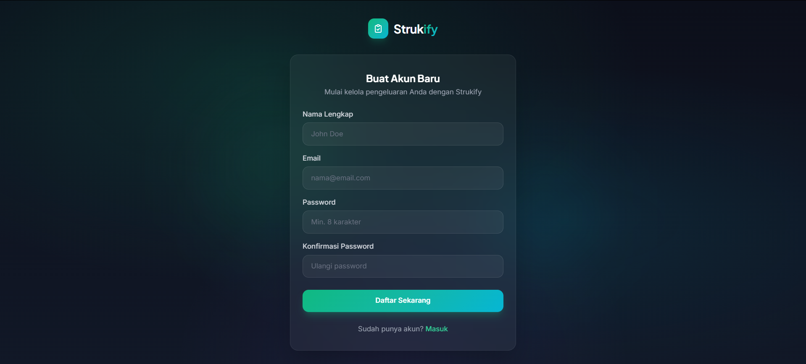
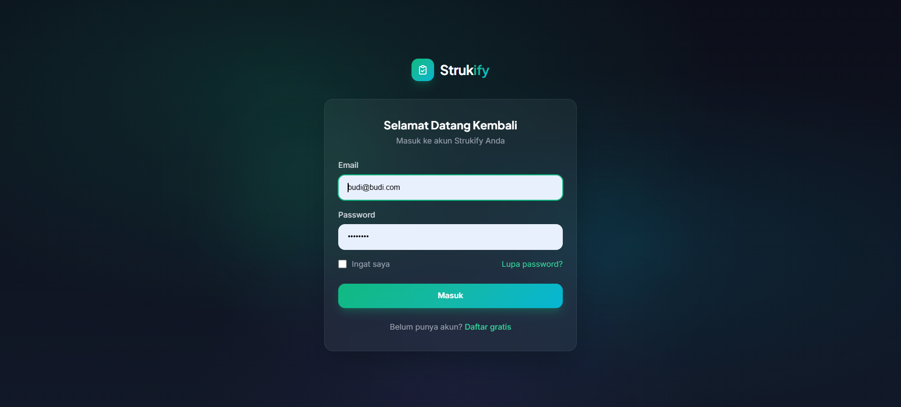
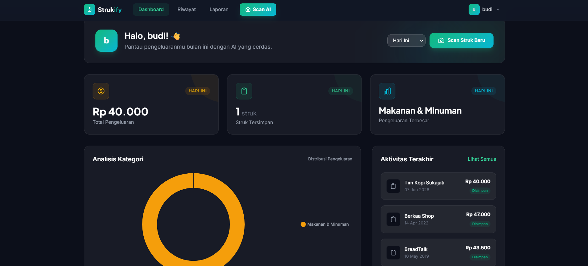
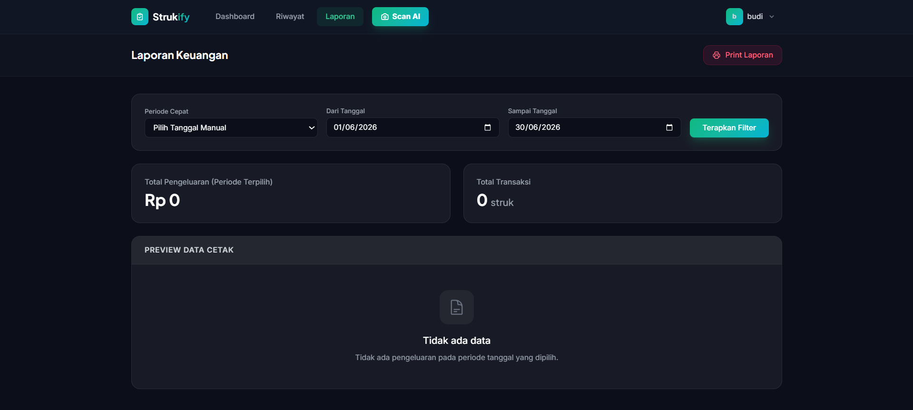

# Strukify - Smart Expense Tracker & Receipt Scanner


## 👥 Identitas Pengembang
**Tim Pengembang Strukify**

<div align='center'>


<br><br>

[](https://github.com/aldypermana20) 
[](https://github.com/) 
[](https://github.com/) 
[](https://github.com/)
[](https://github.com/)
[](https://github.com/)

<br>

[](http://if.uinsgd.ac.id/)
[](https://uinsgd.ac.id/)

</div>

---

## 📄 Tentang Strukify
**Strukify** adalah aplikasi *Smart Expense Tracker* berbasis web yang dirancang untuk mempermudah pencatatan pengeluaran harian.  
Aplikasi ini membantu pengguna memindai struk belanja secara otomatis menggunakan *Artificial Intelligence* (OCR & NLP), mendeteksi harga barang, dan mengkategorikan pengeluaran tanpa perlu input manual yang memakan waktu.

---

# 1. Business Understanding


### Latar Belakang Masalah
Dalam mengelola keuangan pribadi maupun bisnis kecil, mencatat setiap pengeluaran dari struk belanja secara manual sangatlah merepotkan. Pengguna seringkali merasa malas atau lupa mencatat pengeluaran kecil, yang menyebabkan **kebocoran anggaran**, **hilangnya data pengeluaran historis**, dan **kesulitan dalam melacak kategori pengeluaran terbesar**.

### Identifikasi Masalah
Proyek ini dikembangkan untuk menjawab permasalahan berikut:
1.  Lamanya waktu yang dibutuhkan untuk menginput item struk belanja satu per satu secara manual.
2.  Kesulitan dalam mengkategorikan pengeluaran belanja (makanan, elektronik, kebutuhan rumah).
3.  Tidak adanya rekapitulasi data pengeluaran bulanan yang informatif.
4.  Susahnya mendeteksi pola belanja dan mengatur keuangan dengan efektif.

### Tujuan Teknis & Kriteria Sukses
* Mengembangkan sistem **Smart Receipt Scan** menggunakan AI untuk mengekstrak teks dari foto struk.
* Membangun sistem **Auto Categorization** untuk mengelompokkan item belanja secara otomatis.
* Mengimplementasikan fitur **Manual Edit & Review** untuk fleksibilitas pengguna.
* Menyediakan **Dashboard & Analytics** untuk visualisasi pengeluaran bulanan.

---

# 2. Modelling (Features & Tech)


Solusi ini dibangun menggunakan arsitektur *Monolithic* untuk Frontend & Core Backend, serta *Microservice* untuk pemrosesan AI.

### Fitur Unggulan (The Solution)
1.  **Smart Receipt Scan:** Integrasi FastAPI & EasyOCR untuk membaca dan mendeteksi item dan total harga dari struk.
2.  **Auto Categorization:** Sistem NLP sederhana untuk mengelompokkan pengeluaran ke dalam kategori yang sesuai.
3.  **Review & Edit:** Antarmuka reaktif dengan Alpine.js untuk memeriksa hasil scan AI sebelum disimpan permanen.
4.  **Dashboard Analytics:** Visualisasi data pengeluaran (Chart.js) dan rekapitulasi laporan bulanan hingga ekspor PDF.

### Teknologi yang Digunakan
* **Frontend & Core Backend:** Laravel 13, Tailwind CSS v4, Alpine.js, Vite.
* **Database:** MySQL.
* **AI Microservice:** Python, FastAPI, EasyOCR & PyTorch, OpenCV, NumPy.

---

# 3. Data Understanding & Preparation


### Karakteristik Data
Data disimpan menggunakan struktur relasional pada MySQL dengan tabel utama:
* **Users:** Data autentikasi pengguna.
* **Receipts:** Data transaksi struk utama (`user_id`, `merchant_name`, `total_amount`, `date`).
* **Receipt Items:** Detail barang dari setiap struk (`receipt_id`, `name`, `price`, `category_id`).
* **Categories:** Master data kategori pengeluaran (Makanan, Transportasi, dsb).

### Data Preparation (Logic)
Untuk memastikan data siap digunakan user, kami menerapkan:
* **Image Processing:** Pre-processing gambar (OpenCV/NumPy) sebelum diumpankan ke model OCR (EasyOCR) untuk meningkatkan akurasi pembacaan.
* **Data Extraction & Regex:** Ekstraksi pola harga dan nama item dari raw text hasil OCR.
* **Reactive UI:** Menggunakan Alpine.js untuk memungkinkan edit *on-the-fly* pada hasil scan tanpa reload halaman.

---

## 4. Cara Menjalankan Project (Local Development)

### 1. Menjalankan Laravel (Web App)

```bash
# Instal dependensi PHP
composer install

# Copy file .env dan generate key
cp .env.example .env
php artisan key:generate

# Konfigurasi Database di .env (pastikan menggunakan kredensial MySQL yang benar)
DB_CONNECTION=mysql
DB_HOST=127.0.0.1
DB_PORT=3306
DB_DATABASE=strukify
DB_USERNAME=root
DB_PASSWORD=

# Jalankan migrasi dan seeder
php artisan migrate --seed

# Buat storage link untuk upload gambar
php artisan storage:link

# Instal dependensi frontend dan jalankan Vite
npm install
npm run dev

# Di terminal baru, jalankan server Laravel
php artisan serve
```

### 2. Menjalankan AI Microservice (FastAPI)

```bash
# Masuk ke direktori AI Service
cd ai-service

# Buat virtual environment
python -m venv venv

# Aktivasi virtual environment (Windows)
.\venv\Scripts\activate

# Instal dependensi Python (EasyOCR, PyTorch, FastAPI, dll)
pip install -r requirements.txt

# Jalankan server FastAPI
python main.py
```

---
# 6. Bukti Testing (Testing Evidence)


Bagian ini berisi dokumentasi hasil pengujian sistem beserta bukti *screenshot*-nya.

| No | Fitur / Skenario Pengujian | Hasil yang Diharapkan | Status | Bukti Screenshot |
|---|---|---|:---:|---|
| 1 | Landing Page | Halaman utama berhasil dimuat dengan baik dan menampilkan informasi aplikasi secara responsif. | ✅ Pass |  |
| 2 | Register | Pengguna baru berhasil mendaftar akun dengan data yang valid dan diarahkan ke halaman login. | ✅ Pass |  |
| 3 | Login | Pengguna berhasil masuk ke sistem dengan kredensial yang valid dan diarahkan ke halaman Dashboard. | ✅ Pass |  |
| 4 | Dashboard | Menampilkan ringkasan data pengeluaran dan grafik analitik secara akurat berdasarkan data akun. | ✅ Pass |  |
| 5 | Scan Struk | Sistem berhasil menerima unggahan foto struk pengguna dan menampilkannya dengan baik. | ✅ Pass |  |
| 6 | Ai Proses | Model AI berhasil mengekstrak teks, mendeteksi item/harga, dan mengkategorikannya secara otomatis. | ✅ Pass |  |
| 7 | Riwayat Struk 1 | Menampilkan daftar riwayat struk yang telah dipindai secara berurutan beserta tanggal dan totalnya. | ✅ Pass |  |
| 8 | Riwayat Struk 2 | Menampilkan detail lengkap (item, harga, kategori) dari salah satu struk belanja yang tersimpan. | ✅ Pass |  |
| 9 | Riwayat Struk 3 | Fungsionalitas manajemen riwayat struk (misal: pencarian, filter, atau hapus) berjalan dengan lancar. | ✅ Pass |  |
| 10 | Simpan Struk | Data struk belanja yang telah di-*review* berhasil disimpan secara permanen ke dalam database. | ✅ Pass |  |
| 11 | Laporan | Sistem berhasil merangkum total pengeluaran dan menampilkannya sebagai laporan/rekapitulasi yang valid. | ✅ Pass |  |
---
<div align='center'>
<small>Made with ❤️ by Team Strukify | UIN Sunan Gunung Djati Bandung</small>
</div>
